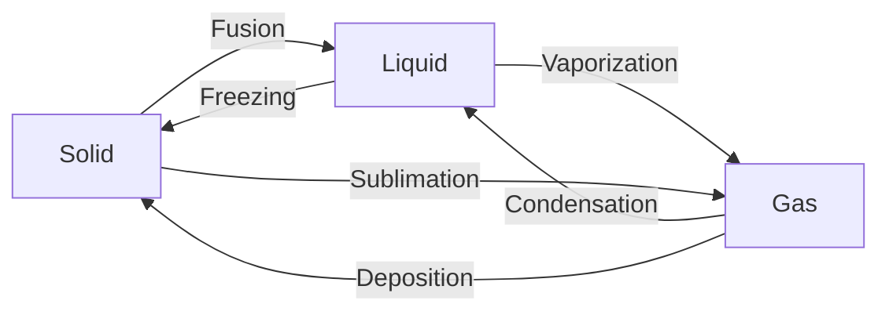

# FAD1018 W5-W6 — Phase Equilibria

Weeks 5–6 lectures covering phase equilibria, colligative properties, Raoult's law, and fractional distillation. Source files: `W5 (1).pdf`, `W5 (2).pdf`, `W6 (1).pdf`.

**Lecturer:** Puan Zuraini Kadir (zuraini81@um.edu.my)

**References:**
- Chemistry, R. Chang
- Comprehensive College Chemistry
- Principles of Chemistry, Tro

## Summary

Three lectures on phase equilibria: (1) phase definitions, colligative properties, and one-component phase diagrams; (2) ideal/non-ideal solutions and Raoult's law; (3) fractional distillation and azeotropes.

---

## Learning Outcomes

1. Define phase and component
2. Define colligative properties
3. Perform calculations on colligative properties
4. Define triple point and critical point for single-component systems
5. Sketch phase diagrams of compounds similar to H₂O and CO₂
6. Describe phase changes with respect to temperature and pressure
7. State properties of ideal and non-ideal solutions for two-component systems
8. Define and apply Raoult's law
9. Define azeotrope
10. Determine composition of an azeotropic mixture
11. Sketch phase diagrams for two-component systems: ideal, positive deviation, and negative deviation from Raoult's law
12. Explain principles involved in fractional distillation
13. Determine residue and distillate from boiling point–composition phase diagrams

---

## Lecture 1 — Phase, Components & Colligative Properties (W5)

### Phase & Component Definitions

- **Phase**: A homogeneous part of a system separated by distinct physical boundaries (solid, liquid, gas).
- **Component**: A chemically independent constituent of a system.

| System | Phase | Component | Description |
|--------|-------|-----------|-------------|
| Mixture of O₂, N₂, H₂ gases | 1 | 3 | Gases well mixed; no visible boundary |
| Oil + water (unmixed) | 2 | 2 | Boundary between two liquids |
| Alcohol + water (mixed) | 1 | 2 | No boundary; miscible |
| Salt solution | 1 | 2 | Salt + water |
| Saturated CuSO₄ in closed bottle | 3 | 2 | Solid, liquid, gas (water vapour) |
| Steel | 1 | 2 | Fe + C |

```smiles
O=O
```
```smiles
N#N
```
```smiles
[H][H]
```
```smiles
[Na+].[Cl-]
```
```smiles
[Cu+2].[O-]S([O-])(=O)=O
```
### Types of Phase Changes



### Colligative Properties

Properties that depend on solute particle concentration, not identity:

1. **Freezing point depression**: $ΔT_f = K_f m$
2. **Boiling point elevation**: $ΔT_b = K_b m$
3. **Vapor pressure lowering**: $ΔP = X_2 P_1^o$
4. **Osmotic pressure**: $Π = MRT$

Where:
- $K_f$ = freezing-point depression constant
- $K_b$ = boiling point elevation constant
- $m$ = molality (mol solute / kg solvent)
- $M$ = molarity (mol / L)
- $X$ = mole fraction
- $R$ = 0.0821 L atm mol⁻¹ K⁻¹

#### Vapor Pressure Lowering (Raoult's Law)

Partial pressure of solvent over solution:
$$P_A = X_A P_A^o$$

For 2-component system:
$$X_A + X_B = 1$$
$$P_A = (1 - X_B) P_A^o$$
$$ΔP = P_A^o - P_A = X_B P_A^o$$

> [!example] Example: Glucose solution
> 218 g glucose (RMM = 180.2) dissolved in 460 mL water at 30°C. $P_{water}^o = 31.82$ mmHg.
>
> $n_{water} = 460 / 18 = 25.5$ mol
> $n_{glucose} = 218 / 180.2 = 1.21$ mol
> $X_{glucose} = 1.21 / (25.5 + 1.21) = 0.0453$
> $ΔP = 0.0453 × 31.82 = 1.44$ mmHg
> New vapor pressure = $31.82 - 1.44 = 30.38$ mmHg

```smiles
C([C@@H]1[C@H]([C@@H]([C@H](C(O1)O)O)O)O)O
```
#### Freezing Point Depression

$$ΔT_f = K_f m = T_{solution} - T_{solvent}$$

> [!example] Example: Naphthalene in benzene
> 1.60 g naphthalene (C₁₀H₈) in 20.0 g benzene. $K_f$ (benzene) = 4.3 °C m⁻¹. Pure benzene fp = 5.5°C.
>
> Molar mass naphthalene = 128.17 g/mol
> $m = (1.60 / 128.17) / 0.0200 = 0.624$ mol/kg
> $ΔT_f = 4.3 × 0.624 = 2.68$°C
> Freezing point = $5.5 - 2.68 = 2.82$°C

```smiles
c1ccc2ccccc2c1
```
```smiles
c1ccccc1
```
#### Boiling Point Elevation

$$ΔT_b = K_b m = T_{b,solution} - T_{b,solvent}$$

> [!example] Example: Ethylene glycol as antifreeze
> 651 g EG in 2505 g water. RMM EG = 62. $K_f = 1.86$ °C/m, $K_b = 0.52$ °C/m.
>
> $n_{EG} = 651 / 62 = 10.5$ mol
> $m = 10.5 / 2.505 = 4.19$ mol/kg
> $ΔT_f = 1.86 × 4.19 = 7.79$°C → fp = $-7.79$°C
> $ΔT_b = 0.52 × 4.19 = 2.18$°C → bp = $102.18$°C

```smiles
OCCO
```
#### Osmotic Pressure

$$ΠV = nRT \quad \text{or} \quad Π = MRT$$

> [!example] Example: Glycerin solution
> 46.0 g glycerin (C₃H₈O₃) per liter at 0°C. RMM = 92.
>
> $n = 46 / 92 = 0.5$ mol
> $Π = (0.5 / 1.0) × 0.0821 × 273 = 11.21$ atm

```smiles
OCC(O)CO
```
> [!example] Example: Polystyrene molecular weight
> 5.0 g polystyrene/L, $Π = 0.0100$ atm at 25°C.
>
> $n = ΠV / RT = (0.0100 × 1) / (0.0821 × 298) = 4.09 × 10^{-4}$ mol
> $M = 5.0 / 4.09 × 10^{-4} = 1.22 × 10^4$ g/mol

```smiles
C=CC1=CC=CC=C1
```
### One-Component Phase Diagrams

**Water:**
- Triple point: 0.01°C, 0.006 atm
- Critical point: 374°C, 218 atm
- Normal bp: 100°C (1 atm)
- Normal fp: 0°C (1 atm)
- Solid-liquid line has **negative slope** (ice less dense than water)

**Carbon Dioxide:**
- Triple point: −56.6°C, 5.11 atm
- Critical point: 31.1°C, 73 atm
- Sublimes at 1 atm (dry ice)
- Solid-liquid line has **positive slope** (solid denser than liquid)

```smiles
O
```
```smiles
O=C=O
```
---

## Lecture 2 — Solutions & Raoult's Law (W5)

### Molecular View of Solution Process

- Break A–A and B–B interactions (requires energy, $E_1$)
- Form A–B interactions (releases energy, $E_2$)
- $ΔH_{solution} = E_1 - E_2$

### Types of Solutions

| Type | Condition | $ΔH_{soln}$ | $ΔV$ | Example |
|------|-----------|-------------|------|---------|
| **Ideal** | A–A ≈ B–B ≈ A–B | 0 | 0 | Benzene–toluene |
| **Positive deviation** | A–A, B–B > A–B | +ve (endothermic) | +ve | Ethanol–water |
| **Negative deviation** | A–B > A–A, B–B | −ve (exothermic) | −ve | HCl–water |

```smiles
c1ccccc1
```
```smiles
Cc1ccccc1
```
```smiles
CCO
```
```smiles
O
```
```smiles
Cl
```
### Raoult's Law

For a two-component miscible liquid mixture:

$$P_A = X_A P_A^o$$
$$P_B = X_B P_B^o$$

By Dalton's law:
$$P_{total} = P_A + P_B = X_A P_A^o + X_B P_B^o$$

Where $X_A + X_B = 1$.

- **Ideal solution**: obeys Raoult's law exactly ($P_1 = X_1 P_1^o$)
- **Positive deviation**: $P_{actual} > P_{calculated}$
- **Negative deviation**: $P_{actual} < P_{calculated}$

> [!example] Example: Raoult's law verification
> Pure A: 60 kPa; Pure B: 30 kPa. Mixture: $X_A = 0.3$, $X_B = 0.7$, $P_{total} = 39$ kPa.
>
> $P_{total,calc} = 0.3(60) + 0.7(30) = 18 + 21 = 39$ kPa
> Therefore, the mixture **obeys Raoult's law** (ideal).

> [!example] Example: CS₂–acetone mixture
> 3.95 g CS₂ + 2.43 g acetone at 35°C. $P°_{CS₂} = 515$ torr, $P°_{acetone} = 332$ torr.
> Molar masses: CS₂ = 76.15, acetone = 58.0 g/mol.
>
> $n_{CS₂} = 3.95 / 76.15 = 0.0519$ mol
> $n_{acetone} = 2.43 / 58.0 = 0.0419$ mol
> $X_{CS₂} = 0.0519 / (0.0519 + 0.0419) = 0.553$
> $X_{acetone} = 0.447$
> $P_{CS₂} = 0.553 × 515 = 285$ torr
> $P_{acetone} = 0.447 × 332 = 148$ torr
> $P_{total} = 285 + 148 = 433$ torr

```smiles
C(=S)=S
```
```smiles
CC(=O)C
```
> [!example] Example: Sucrose solution vapor pressure
> 99.5 g sucrose + 300.0 mL water at 25°C. $P°_{water} = 23.8$ torr.
>
> $n_{sucrose} = 99.5 / 342.3 = 0.291$ mol
> $n_{water} = 300 / 18 = 16.67$ mol
> $X_{water} = 16.67 / (16.67 + 0.291) = 0.983$
> $P_{solution} = 0.983 × 23.8 = 23.4$ torr

```smiles
C([C@@H]1[C@H]([C@@H]([C@H]([C@H](O1)O[C@]2([C@H]([C@@H]([C@H](O2)CO)O)O)CO)O)O)O)O
```
---

## Lecture 3 — Fractional Distillation & Azeotropes (W6)

### Fractional Distillation

A procedure for separating liquid components based on different boiling points.

**At the end of distillation:**
1. Liquid with **lower boiling point** → collected in receiving flask (distillate)
2. Liquid with **higher boiling point** → left in distilling flask (residue)

### Phase Diagram: Boiling Point vs Composition

For an **ideal solution A–B**:
- Upper curve: vapor composition
- Lower curve: liquid composition
- Region between curves: liquid + vapor coexistence

### Azeotrope

A mixture that distills at constant composition (cannot be separated by simple fractional distillation).

#### Positive Deviation Azeotropes

- Azeotrope has **minimum boiling point** and **maximum vapor pressure**
- Boiling point of mixture **lower** than either pure component

**Ethanol–Benzene system:**
- Azeotrope: 32.4% ethanol
- Starting < 32.4% ethanol → distillate = azeotrope, residue = benzene
- Starting > 32.4% ethanol → distillate = azeotrope, residue = ethanol
- Starting = azeotrope → only azeotrope distills over

**Ethanol–Water system:**
- Azeotrope: 95.6% ethanol + 4.4% water
- Bp = 78.2°C (lower than pure ethanol 78.4°C and water 100°C)

```smiles
CCO
```
```smiles
c1ccccc1
```
> [!note] Characteristics of positive deviation
> - $P_{total} > P_{theoretical}$
> - Endothermic solution ($ΔH = +ve$)
> - $ΔV = +ve$ (expansion)
> - $T_{b,A-B} > T_{b,A}$ or $T_{b,B}$ — **correction**: actually $T_{b,azeotrope} < T_{b,pure}$

#### Negative Deviation Azeotropes

- Azeotrope has **maximum boiling point** and **minimum vapor pressure**
- Boiling point of mixture **higher** than either pure component

**HCl–Water system:**
- Azeotrope: 20.2% HCl
- Starting < 20.2% HCl → distillate = pure H₂O, residue = azeotrope
- Starting > 20.2% HCl → distillate = pure HCl, residue = azeotrope

**Nitric Acid–Water system:**
- Azeotrope: 68% HNO₃ + 32% water
- Bp = 120.5°C (higher than pure HNO₃ 78°C and water 100°C)

```smiles
Cl
```
```smiles
O
```
```smiles
O=[N+]([O-])O
```
> [!note] Characteristics of negative deviation
> - $P_{total} < P_{theoretical}$
> - Exothermic solution ($ΔH = -ve$)
> - $ΔV = -ve$ (shrinkage)

### Key Distillation Rules

| Deviation | Starting Composition | Distillate | Residue |
|-----------|---------------------|------------|---------|
| Positive | < azeotrope % | Azeotrope | Higher bp component |
| Positive | > azeotrope % | Azeotrope | Higher bp component |
| Negative | < azeotrope % | Lower bp pure component | Azeotrope |
| Negative | > azeotrope % | Higher bp pure component | Azeotrope |

---

## Key Equations

| Property | Equation |
|----------|----------|
| Gibbs Phase Rule | $F = C - P + 2$ |
| Raoult's Law | $P_A = X_A P_A^o$ |
| Dalton's Law | $P_{total} = P_A + P_B$ |
| Vapor pressure lowering | $ΔP = X_{solute} P°_{solvent}$ |
| Boiling point elevation | $ΔT_b = K_b m$ |
| Freezing point depression | $ΔT_f = K_f m$ |
| Osmotic pressure | $Π = MRT$ |
| Clausius-Clapeyron | $\ln\frac{P_2}{P_1} = -\frac{ΔH_{vap}}{R}(\frac{1}{T_2} - \frac{1}{T_1})$ |

---

## Related Topics

- [[Phase Equilibria]]
- [[Phase Diagrams]]
- [[Raoult's Law]]
- [[Colligative Properties]]
- [[Chemical Equilibrium]]
- [[Thermochemistry]]
- [[FAD1018 - Basic Chemistry II]]

## Study Notes

> [!note] Exam weightage
> Phase Equilibria appears in most papers with ~5–8% mark weight. Focus on:
> - Raoult's Law calculations (vapor pressure, mole fraction)
> - Colligative property calculations ($ΔT_b$, $ΔT_f$, $Π$)
> - Drawing and interpreting phase diagrams
> - Fractional distillation predictions from bp-composition diagrams
> - Identifying azeotrope composition and behavior

> [!warning] Common errors
> - Confusing **positive** vs **negative** deviation characteristics
> - Forgetting that azeotropes in positive deviation have **minimum** bp
> - Mixing up distillate vs residue for non-ideal solutions
> - Using molarity instead of molality for colligative properties
